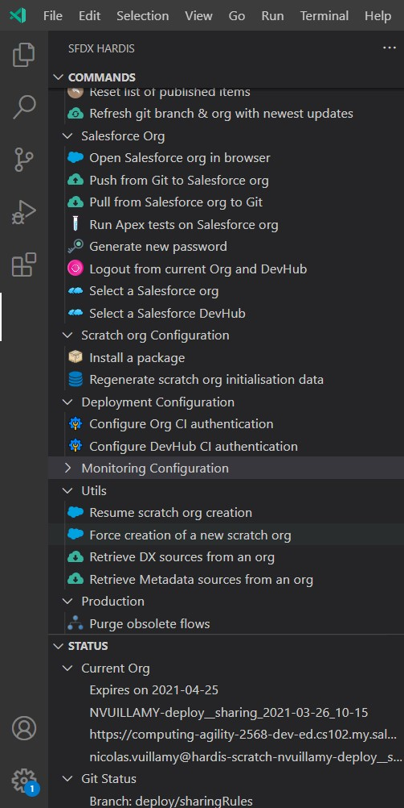

# VsCode SFDX Hardis

## Easy Salesforce DX projects management, even if you don't know Salesforce DX or git

- **Work on a task (assisted)**, for Consulting profiles
  - Git branch & Scratch org initialization
  - Assisted git add
  - Automated generation of package.xml and destructiveChanges.xml
  - Merge request management
- **Work on a task (expert)**, for Technical profiles
  - Initialization of SFDX project from an org (including packages installation and data initialization)
  - Cleaning of sfdx sources to prevent deployment errors
  - Data import / export
- **Debugger**
- **Configuration** (including JWT auth using openssl and Connected App metadata upload)
  - Configure deployment for CI
  - Configure DevHub for CI
  - Shortcut to config files
- **Packaging** (unlocked or managed)
- **Production**
  - Purge obsolete flow versions
  - Purge apex debug logs

## Assisted UI

Integration between VsCode SFDX Hardis UI and sfdx-hardis CLI, so you don't need to know the commands or their arguments

## Dependencies

[**sfdx-hardis**](https://github.com/hardisgroupcom/sfdx-hardis) partially relies on the following SFDX Open-Source packages

- [Salesforce Data Move Utility](https://github.com/forcedotcom/SFDX-Data-Move-Utility)
- [SFDX Essentials](https://github.com/nvuillam/sfdx-essentials)
- [SFDX Git Delta](https://github.com/scolladon/sfdx-git-delta)
- [SfPowerkit](https://github.com/Accenture/sfpowerkit)
- [Texei Sfdx Plugin](https://github.com/texei/texei-sfdx-plugin)

## Who we are

Powered by [Hardis Group](https://www.customer-platform.com/)

