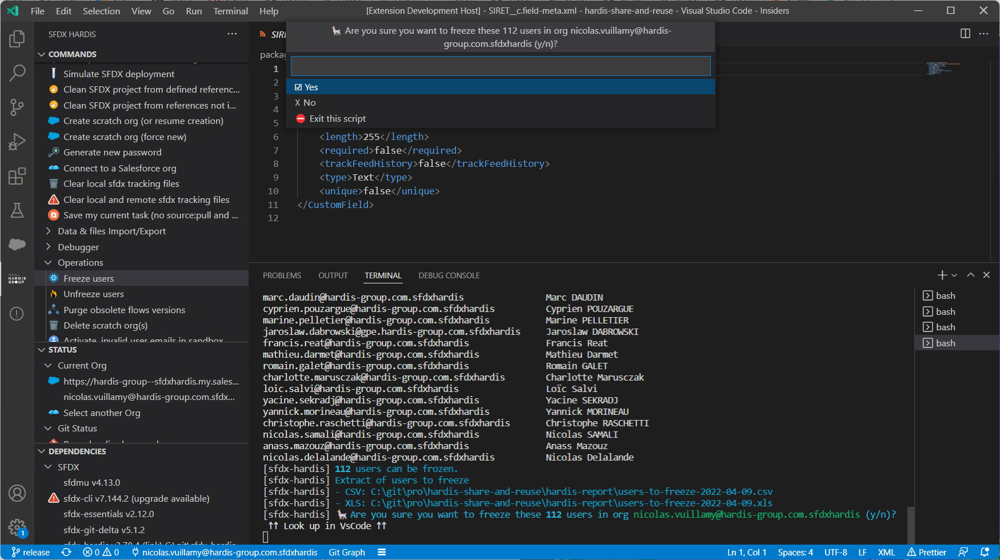
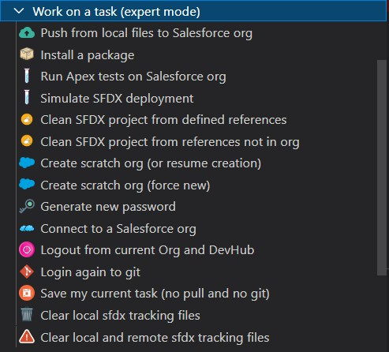
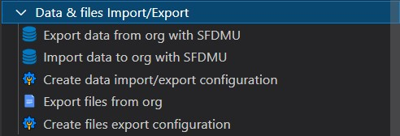
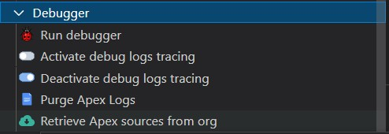

[](https://www.hardis-group.com/en/services-solutions/services/integration/salesforce-consulting-and-integration)

# VsCode SFDX Hardis

[](https://marketplace.visualstudio.com/items?itemName=NicolasVuillamy.vscode-sfdx-hardis)
[](https://marketplace.visualstudio.com/items?itemName=NicolasVuillamy.vscode-sfdx-hardis)
[](https://github.com/nvuillam/mega-linter#readme)
[](https://github.com/hardisgroupcom/vscode-sfdx-hardis/blob/master/LICENSE)
[](https://github.com/hardisgroupcom/vscode-sfdx-hardis/stargazers/)
[](http://makeapullrequest.com)

## Easy Salesforce DX projects management, even if you don't know Salesforce DX or git

Salesforce DX is great.

But there are so many base commands and so many useful plugins that it's easy to get lost.

VsCode SFDX-Hardis aims to simplify the use of Salesforce DX with an intuitive UI and ready to use pre-integrated commands.



Here are some articles with examples of use of [sfdx-hardis](https://hardisgroupcom.github.io/sfdx-hardis/)

- English
  - [Handle Salesforce API versions Deprecation like a pro](https://nicolas.vuillamy.fr/handle-salesforce-api-versions-deprecation-like-a-pro-335065f52238)
  - [How to mass download notes and attachments files from a Salesforce org](https://nicolas.vuillamy.fr/how-to-mass-download-notes-and-attachments-files-from-a-salesforce-org-83a028824afd)
  - [How to freeze / unfreeze users during a Salesforce deployment](https://medium.com/@dimitrimonge/freeze-unfreeze-users-during-salesforce-deployment-8a1488bf8dd3)
  - [How to detect bad words in Salesforce records using SFDX Data Loader and sfdx-hardis](https://nicolas.vuillamy.fr/how-to-detect-bad-words-in-salesforce-records-using-sfdx-data-loader-and-sfdx-hardis-171db40a9bac)

- French
  - [Versions d'API Salesforce décommissionnées: Que faire ?](https://leblog.hardis-group.com/portfolio/versions-dapi-salesforce-decommissionnees-que-faire/)
  - [Exporter en masse les fichiers d’une org Salesforce](https://leblog.hardis-group.com/portfolio/exporter-en-masse-les-fichiers-dune-org-salesforce/)
  - [Suspendre l’accès aux utilisateurs lors d’une mise en production Salesforce](https://leblog.hardis-group.com/portfolio/suspendre-lacces-aux-utilisateurs-lors-dune-mise-en-production-salesforce/)

## Assisted UI

Integration between VsCode SFDX Hardis UI and sfdx-hardis CLI, so you don't need to know the commands or their arguments

### Work on a task (simple)

Base commands allowing to a consulting profile to work on a SFDX project without knowing SFDX or Git

- Git branch & Scratch org initialization
- Assisted git add
- Automated generation of package.xml and destructiveChanges.xml
- Merge request management


### Work on a task (Expert)

Advanced commands allowing a technical profile to work on a sfdx project without knowing SFDX or Git

- Initialization of SFDX project from an org (including packages installation)
- Cleaning of sfdx sources to prevent deployment errors



### Data Import & Export

Manage data import / export using [Salesforce Data Move Utility](https://github.com/forcedotcom/SFDX-Data-Move-Utility)

- Configure data import / export
- Perform data import / export



### Debugger

Ease sources execution debugging of any type of org



### Configuration

Configuration helpers

- Configure deployment for CI
- Configure DevHub for CI
- Shortcut to configuration files


### Operations

General sfdx operations

- Initialize sfdx project
- Generate package.xml from delta between 2 commits, using [sfdx-git-delta](https://github.com/scolladon/sfdx-git-delta)
- Metadata / sfdx sources operations


### Packaging

Simplify creation and maintenance of packaging V2 packages (unlocked or managed)

- Create packaging V2 packages
- Manage package versions


### Production

Production operations

- Purge production elements


### Custom commands

You can **define your own custom commands** that will appear at the bottom of the menu.


- Create or update existing file `config/.sfdx-hardis.yml` in your project, and add property **customCommands** , that will contain other menus and commands under each of them.

- Icons can be any of the [SVG files in this folder](https://github.com/hardisgroupcom/vscode-sfdx-hardis/tree/master/resources)

- Once updated, please refresh the VsCode Sfdx Hardis Commands panel to see the changes.

Example of `config/.sfdx-hardis.yml`:

```yaml
customCommands:
  - id: custom-menu
    label: Custom commands
    commands:
      - id: generate-manifest-xml
        label: Generate manifest
        icon: file.svg
        tooltip: Generates a manifest package.xml using local sfdx source files
        command: sfdx force:source:manifest:create --sourcepath force-app --manifestname myNewManifest
      - id: list-all-orgs
        label: List all orgs
        icon: salesforce.svg
        tooltip: List all orgs that has already been authenticated using sfdx
        command: sfdx force:org:list --all
  - id: custom-menu-2
    label: Another custom menu
    commands:
      - id: echo
        label: Echo something
        icon: user.svg
        tooltip: Useless commands just to show that we can use not sfdx commands too
        command: echo "Something"
```

## Dependencies

[**sfdx-hardis**](https://github.com/hardisgroupcom/sfdx-hardis) partially relies on the following SFDX Open-Source packages

- [Salesforce Data Move Utility](https://github.com/forcedotcom/SFDX-Data-Move-Utility)
- [SFDX Essentials](https://github.com/nvuillam/sfdx-essentials)
- [SFDX Git Delta](https://github.com/scolladon/sfdx-git-delta)
- [SfPowerkit](https://github.com/Accenture/sfpowerkit)
- [Texei Sfdx Plugin](https://github.com/texei/texei-sfdx-plugin)

## Who we are

Powered by [Hardis Group](https://www.customer-platform.com/)

