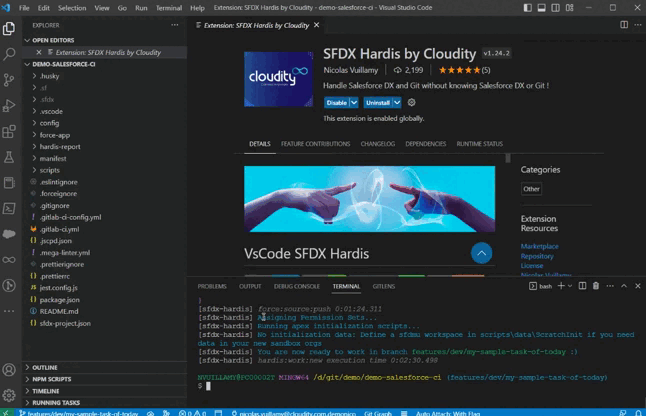
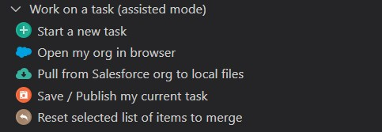
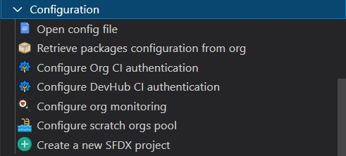

[](https://www.hardis-group.com/en/services-solutions/services/integration/salesforce-consulting-and-integration)

# VsCode SFDX Hardis

[](https://marketplace.visualstudio.com/items?itemName=NicolasVuillamy.vscode-sfdx-hardis)
[](https://marketplace.visualstudio.com/items?itemName=NicolasVuillamy.vscode-sfdx-hardis)
[](https://github.com/nvuillam/mega-linter#readme)
[](https://github.com/hardisgroupcom/vscode-sfdx-hardis/blob/master/LICENSE)
[](https://github.com/hardisgroupcom/vscode-sfdx-hardis/stargazers/)
[](http://makeapullrequest.com)

**Easy Salesforce DX projects management, even if you don't know Salesforce DX or git**

Salesforce DX is great.

But there are so many base commands and so many useful plugins that it's easy to get lost.

VsCode SFDX-Hardis aims to simplify the use of Salesforce DX with an intuitive UI and ready to use pre-integrated commands.



- [Articles](#articles)
- [Assisted UI](#assisted-ui)
	- [Work on a task (simple)](#work-on-a-task-simple)
	- [Work on a task (Expert)](#work-on-a-task-expert)
	- [Data Import & Export](#data-import--export)
	- [Debugger](#debugger)
	- [Operations](#operations)
	- [Audit](#audit)
	- [Configuration](#configuration)
	- [Packaging](#packaging)
	- [Nerdy stuff](#nerdy-stuff)
- [Custom commands](#custom-commands)
- [Dependencies](#dependencies)
- [Who we are](#who-we-are)

## Articles

Here are some articles with examples of use of [sfdx-hardis](https://hardisgroupcom.github.io/sfdx-hardis/)

- English

[](https://nicolas.vuillamy.fr/handle-salesforce-api-versions-deprecation-like-a-pro-335065f52238)
[](https://nicolas.vuillamy.fr/how-to-mass-download-notes-and-attachments-files-from-a-salesforce-org-83a028824afd)
[](https://medium.com/@dimitrimonge/freeze-unfreeze-users-during-salesforce-deployment-8a1488bf8dd3)
[](https://nicolas.vuillamy.fr/how-to-detect-bad-words-in-salesforce-records-using-sfdx-data-loader-and-sfdx-hardis-171db40a9bac)
[](https://nicolas.vuillamy.fr/reactivate-all-the-sandbox-users-with-invalid-emails-in-3-clicks-2265af4e3a3d)


- French
  - [Versions d'API Salesforce décommissionnées: Que faire ?](https://leblog.hardis-group.com/portfolio/versions-dapi-salesforce-decommissionnees-que-faire/)
  - [Exporter en masse les fichiers d’une org Salesforce](https://leblog.hardis-group.com/portfolio/exporter-en-masse-les-fichiers-dune-org-salesforce/)
  - [Suspendre l’accès aux utilisateurs lors d’une mise en production Salesforce](https://leblog.hardis-group.com/portfolio/suspendre-lacces-aux-utilisateurs-lors-dune-mise-en-production-salesforce/)

## Assisted UI

Integration between VsCode SFDX Hardis UI and sfdx-hardis CLI, so you don't need to know the commands or their arguments

### Work on a task (simple)



Base commands allowing to a consultant profile to work on a SFDX project without knowledge about SFDX or Git

- [Start a new task](https://hardisgroupcom.github.io/sfdx-hardis/hardis/work/new/)
- Open my org in browser
- [Pull from Salesforce org to local files](https://hardisgroupcom.github.io/sfdx-hardis/hardis/scratch/pull/)
- [Save / Publish my current task](https://hardisgroupcom.github.io/sfdx-hardis/hardis/work/save/)
- [Reset selected list of items to merge](https://hardisgroupcom.github.io/sfdx-hardis/hardis/work/resetselection/)

### Work on a task (Expert)


Advanced commands allowing a technical profile to work on a sfdx project without knowing SFDX or Git

- [Push from local files to Salesforce org](https://hardisgroupcom.github.io/sfdx-hardis/hardis/scratch/push/)
- [Install a package](https://hardisgroupcom.github.io/sfdx-hardis/hardis/package/install/)
- [Run Apex tests on Salesforce org](https://hardisgroupcom.github.io/sfdx-hardis/hardis/org/test/apex/)
- [Simulate SFDX Deployment](https://hardisgroupcom.github.io/sfdx-hardis/hardis/project/deploy/sources/dx/)
- [Clean SFDX Project from defined references](https://hardisgroupcom.github.io/sfdx-hardis/hardis/project/clean/references/)
- [Clean SFDX Project from references not in target org](https://hardisgroupcom.github.io/sfdx-hardis/hardis/project/clean/orgmissingitems/)
- [Create scratch org (or resume creation)](https://hardisgroupcom.github.io/sfdx-hardis/hardis/scratch/create/)
- [Create scratch org (force new)](https://hardisgroupcom.github.io/sfdx-hardis/hardis/scratch/create/)
- [Generate new password](https://developer.salesforce.com/docs/atlas.en-us.sfdx_dev.meta/sfdx_dev/sfdx_dev_scratch_orgs_passwd.htm)
- [Connect to a Salesforce org](https://hardisgroupcom.github.io/sfdx-hardis/hardis/org/connect/)
- [Clear local sfdx tracking files](https://developer.salesforce.com/docs/atlas.en-us.sfdx_cli_reference.meta/sfdx_cli_reference/cli_reference_force_source.htm#cli_reference_force_source_tracking_clear)
- [Clear local and remote sfdx tracking files](https://developer.salesforce.com/docs/atlas.en-us.sfdx_cli_reference.meta/sfdx_cli_reference/cli_reference_force_source.htm#cli_reference_force_source_tracking_reset)

### Data Import & Export


Manages data and files import / export using [Salesforce Data Move Utility](https://github.com/forcedotcom/SFDX-Data-Move-Utility)

- [Export data from org with SFDMU](https://hardisgroupcom.github.io/sfdx-hardis/hardis/org/data/export/)
- [Import data to org with SFDMU](https://hardisgroupcom.github.io/sfdx-hardis/hardis/org/data/import/)
- [Create data import/export configuration](https://hardisgroupcom.github.io/sfdx-hardis/hardis/org/configure/data/)
- [Export files from org](https://hardisgroupcom.github.io/sfdx-hardis/hardis/org/files/export/)
- [Create files export configuration](https://hardisgroupcom.github.io/sfdx-hardis/hardis/org/configure/files/)

### Debugger


Ease sources execution debugging of any type of org

### Operations


Handy operations on Salesforce org

- [Freeze users](https://hardisgroupcom.github.io/sfdx-hardis/hardis/org/user/freeze/)
- [Unfreeze users](https://hardisgroupcom.github.io/sfdx-hardis/hardis/org/user/unfreeze/)
- [Purge obsolete flows versions](https://hardisgroupcom.github.io/sfdx-hardis/hardis/org/purge/flow/)
- [Delete scratch org(s)](https://hardisgroupcom.github.io/sfdx-hardis/hardis/scratch/delete/)
- [Activate .invalid user emails in sandbox](https://hardisgroupcom.github.io/sfdx-hardis/hardis/org/user/activateinvalid/)

### Audit


Audit Tools for your orgs

- [Detect legacy API versions usage](https://hardisgroupcom.github.io/sfdx-hardis/hardis/org/diagnose/legacyapi/)

### Configuration



Configuration helpers

- Shortcuts to configuration files
- Configure deployment for CI
- Configure DevHub for CI

### Packaging


Simplify creation and maintenance of packaging V2 packages (unlocked or managed)

- Create packaging V2 packages
- Manage package versions

### Nerdy stuff


Use at your own risk :)

## Custom commands


You can **define your own custom commands** that will appear at the beginning or the bottom of the menu.

- In `.sfdx-hardis.yml` file, and add property **customCommands** , that will contain other menus and commands under each of them. It can be defined:
  - Locally in you project, in `config/.sfdx-hardis.yml` file
  - In a `.sfdx-hardis.yml` file, in VsCode setting `custom commands` _(ex: `C:\myfolder\.sfdx-hardis.yml`)_
  - In a remote  `.sfdx-hardis.yml` file, in VsCode setting `custom commands` _(ex: `http://my.server.com/.sfdx-hardis.yml`)_
- Icons can be any of the [SVG files in this folder](https://github.com/hardisgroupcom/vscode-sfdx-hardis/tree/master/resources)
- Once updated, please refresh the VsCode Sfdx Hardis Commands panel to see the changes.

Example of `config/.sfdx-hardis.yml`:

```yaml
customCommandsPosition: first  # can be first or last
customCommands:
  - id: custom-menu
    label: Custom commands
    commands:
      - id: generate-manifest-xml
        label: Generate manifest
        icon: file.svg
        tooltip: Generates a manifest package.xml using local sfdx source files
        command: sfdx force:source:manifest:create --sourcepath force-app --manifestname myNewManifest
        helpUrl: https://megalinter.github.io/
      - id: list-all-orgs
        label: List all orgs
        icon: salesforce.svg
        tooltip: List all orgs that has already been authenticated using sfdx
        command: sfdx force:org:list --all
  - id: custom-menu-2
    label: Another custom menu
    commands:
      - id: echo
        label: Echo something
        icon: user.svg
        tooltip: Useless commands just to show that we can use not sfdx commands too
        command: echo "Something"
```

## Dependencies

[**sfdx-hardis**](https://github.com/hardisgroupcom/sfdx-hardis) partially relies on the following SFDX Open-Source packages

- [Salesforce Data Move Utility](https://github.com/forcedotcom/SFDX-Data-Move-Utility)
- [SFDX Essentials](https://github.com/nvuillam/sfdx-essentials)
- [SFDX Git Delta](https://github.com/scolladon/sfdx-git-delta)
- [SfPowerkit](https://github.com/Accenture/sfpowerkit)
- [Texei Sfdx Plugin](https://github.com/texei/texei-sfdx-plugin)

## Who we are

Powered by [Hardis Group](https://www.customer-platform.com/)

