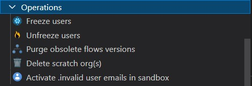

[](https://sfdx-hardis.cloudity.com)

# VsCode SFDX Hardis

[](https://marketplace.visualstudio.com/items?itemName=NicolasVuillamy.vscode-sfdx-hardis)
[](https://marketplace.visualstudio.com/items?itemName=NicolasVuillamy.vscode-sfdx-hardis)
[](https://open-vsx.org/extension/NicolasVuillamy/vscode-sfdx-hardis)
[](https://github.com/nvuillam/mega-linter#readme)
[](https://github.com/hardisgroupcom/vscode-sfdx-hardis/blob/main/LICENSE)
[](https://github.com/hardisgroupcom/vscode-sfdx-hardis/stargazers/)
[](http://makeapullrequest.com)

**Easy Salesforce DX projects management, even if you don't know Salesforce DX or git**

Salesforce DX is great, but there are so many base commands and so many useful plugins that it's easy to get lost.

VsCode SFDX-Hardis aims to simplify the use of Salesforce DX with an intuitive UI and ready to use pre-integrated commands.

You can also use it to [setup and use a complete CI/CD pipeline](https://sfdx-hardis.cloudity.com/salesforce-ci-cd-home/) for your Salesforce project.

_Graciously provided by [**Cloudity**](https://cloudity.com/), and based on sfdx plugin [**sfdx-hardis**](https://sfdx-hardis.cloudity.com/)_


[_Presented at Dreamforce !_](https://reg.salesforce.com/flow/plus/df23/sessioncatalog/page/catalog/session/1684196389783001OqEl)

[](https://www.youtube.com/watch?v=o0Mm9F07UFs)

- [Installation](#installation)
- [Articles](#articles)
- [Panels](#panels)
  - [Commands](#commands)
  - [Status](#status)
  - [Dependencies](#dependencies)
- [Assisted UI](#assisted-ui)
  - [Metadata Retriever](#metadata-retriever)
  - [CI/CD (Simple)](#work-on-a-user-story-simple)
  - [CI/CD (Advanced)](#work-on-a-user-story-expert)
  - [Data Import & Export](#data-import-export)
  - [Debugger](#debugger)
  - [Operations](#operations)
  - [Audit](#audit)
  - [Configuration](#configuration)
  - [Packaging](#packaging)
  - [Nerdy stuff](#nerdy-stuff)
- [Custom commands](#custom-commands)
- [Custom plugins](#custom-plugins)
- [Open Source Dependencies](#open-source-dependencies)
- [Telemetry](#telemetry)
- [Who we are](#who-we-are)

## Installation

To install VsCode sfdx-hardis and all its dependencies, just follow the instructions in the following video !

[](https://www.youtube.com/watch?v=LA8m-t7CjHA)

## Articles

Here are some articles with examples of use of [sfdx-hardis](https://sfdx-hardis.cloudity.com/)

- English

[](https://nicolas.vuillamy.fr/how-to-deploy-conga-composer-configuration-using-salesforce-cli-plugins-c2899641f36b)
[](https://nicolas.vuillamy.fr/what-devops-experts-want-to-know-about-salesforce-ci-cd-with-sfdx-hardis-q-a-1f412db34476)
[](https://salesforcedevops.net/index.php/2023/03/01/sfdx-hardis-open-source-salesforce-release-management/)
[](https://nicolas.vuillamy.fr/handle-salesforce-api-versions-deprecation-like-a-pro-335065f52238)
[](https://nicolas.vuillamy.fr/how-to-mass-download-notes-and-attachments-files-from-a-salesforce-org-83a028824afd)
[](https://medium.com/@dimitrimonge/freeze-unfreeze-users-during-salesforce-deployment-8a1488bf8dd3)
[](https://nicolas.vuillamy.fr/how-to-detect-bad-words-in-salesforce-records-using-sfdx-data-loader-and-sfdx-hardis-171db40a9bac)
[](https://nicolas.vuillamy.fr/reactivate-all-the-sandbox-users-with-invalid-emails-in-3-clicks-2265af4e3a3d)


- French
  - [Versions d'API Salesforce décommissionnées: Que faire ?](https://leblog.hardis-group.com/portfolio/versions-dapi-salesforce-decommissionnees-que-faire/)
  - [Exporter en masse les fichiers d’une org Salesforce](https://leblog.hardis-group.com/portfolio/exporter-en-masse-les-fichiers-dune-org-salesforce/)
  - [Suspendre l’accès aux utilisateurs lors d’une mise en production Salesforce](https://leblog.hardis-group.com/portfolio/suspendre-lacces-aux-utilisateurs-lors-dune-mise-en-production-salesforce/)

## Panels

The extension contains 3 panels

- Commands launcher
- Status
- Dependency management

### Commands

This panel contain all the useful commands to process with clicks only.

It also has shortcut buttons

- Refresh commands panel
- Run debugger
- Decrypt an Outlook clickjack URL
- Open a configuration file (`.sfdx-hardis.yml`,`package.xml`... )

### Status

This panel displays the selected org, dev hub org and git info (repo, branch)

It manage VsCode Theme colors depending on selected org
- Automated
  - Production: red
  - Sandbox of major org (where you are not supposed to deploy ^^): orange
  - Sandbox or scratch org for dev/config: green
  - Other (Dev Org, Trial org...): blue
- Notes
  - If you don't want this feature, use `vsCodeSfdxHardis.disableVsCodeColors` VsCode setting
  - It also allows to associate a custom VsCode Theme color to the current default org, using a shortcut button
  - You can select which settings file the colors will be updated (Workspace- or User settings.json) using `vsCodeSfdxHardis.colorUpdateLocation`
  - Wildcards are supported, which means you can assign a color to a URL such as 'https://*.scratch.my.salesforce.com' in the Hardis config file.

[](https://www.youtube.com/watch?v=6WU4rezC2GM)

### Dependencies

This panel checks all required dependencies, and if they are up to date.

If some a missing or with deprecated versions, a message is displayed to invite the user to click to install / upgrade sfdx dependencies

## Assisted UI

Integration between VsCode SFDX Hardis UI and sfdx-hardis CLI, so you don't need to know the commands or their arguments

### Metadata Retriever

Browse your org Metadatas with an easy to use UI, select what you want to retrieve, and click retrieve.

Filter by type, name, user who last updated, date of last update, and related Managed Package.

This is a replacement of standard extension "Org Browser" with more features.


### Work on a User Story (Simple)


Base commands allowing to a consultant profile to work on a SFDX project without knowledge about SFDX or Git

- [New User Story](https://sfdx-hardis.cloudity.com/hardis/work/new/)
- Open my org in browser
- [Pull from Salesforce org to local files](https://sfdx-hardis.cloudity.com/hardis/scratch/pull/)
- [Save / Publish User Story](https://sfdx-hardis.cloudity.com/hardis/work/save/)
- [Reset selected list of items to merge](https://sfdx-hardis.cloudity.com/hardis/work/resetselection/)

### Work on a User Story (Expert)


Advanced commands allowing a technical profile to work on a sfdx project without knowing SFDX or Git

- [Push from local files to Salesforce org](https://sfdx-hardis.cloudity.com/hardis/scratch/push/)
- [Install a package](https://sfdx-hardis.cloudity.com/hardis/package/install/)
- [Run Apex tests on Salesforce org](https://sfdx-hardis.cloudity.com/hardis/org/test/apex/)
- [Simulate SFDX Deployment](https://sfdx-hardis.cloudity.com/hardis/project/deploy/sources/dx/)
- [Clean SFDX Project from defined references](https://sfdx-hardis.cloudity.com/hardis/project/clean/references/)
- [Clean SFDX Project from references not in target org](https://sfdx-hardis.cloudity.com/hardis/project/clean/orgmissingitems/)
- [Create scratch org (or resume creation)](https://sfdx-hardis.cloudity.com/hardis/scratch/create/)
- [Create scratch org (force new)](https://sfdx-hardis.cloudity.com/hardis/scratch/create/)
- [Generate new password](https://developer.salesforce.com/docs/atlas.en-us.sfdx_dev.meta/sfdx_dev/sfdx_dev_scratch_orgs_passwd.htm)
- [Connect to a Salesforce org](https://sfdx-hardis.cloudity.com/hardis/org/connect/)
- [Clear local sfdx tracking files](https://developer.salesforce.com/docs/atlas.en-us.sfdx_cli_reference.meta/sfdx_cli_reference/cli_reference_force_source.htm#cli_reference_force_source_tracking_clear)
- [Clear local and remote sfdx tracking files](https://developer.salesforce.com/docs/atlas.en-us.sfdx_cli_reference.meta/sfdx_cli_reference/cli_reference_force_source.htm#cli_reference_force_source_tracking_reset)

### Data Import & Export


Manages data and files import / export using [Salesforce Data Move Utility](https://github.com/forcedotcom/SFDX-Data-Move-Utility)

- [Export data from org with SFDMU](https://sfdx-hardis.cloudity.com/hardis/org/data/export/)
- [Import data to org with SFDMU](https://sfdx-hardis.cloudity.com/hardis/org/data/import/)
- [Create data import/export configuration](https://sfdx-hardis.cloudity.com/hardis/org/configure/data/)
- [Export files from org](https://sfdx-hardis.cloudity.com/hardis/org/files/export/)
- [Create files export configuration](https://sfdx-hardis.cloudity.com/hardis/org/configure/files/)

### Debugger


Ease sources execution debugging of any type of org

### Operations



Handy operations on Salesforce org

- [Freeze users](https://sfdx-hardis.cloudity.com/hardis/org/user/freeze/)
- [Unfreeze users](https://sfdx-hardis.cloudity.com/hardis/org/user/unfreeze/)
- [Purge obsolete flows versions](https://sfdx-hardis.cloudity.com/hardis/org/purge/flow/)
- [Delete scratch org(s)](https://sfdx-hardis.cloudity.com/hardis/scratch/delete/)
- [Activate .invalid user emails in sandbox](https://sfdx-hardis.cloudity.com/hardis/org/user/activateinvalid/)

### Audit


Audit Tools for your orgs

- [Detect legacy API versions usage](https://sfdx-hardis.cloudity.com/hardis/org/diagnose/legacyapi/)

### Configuration


Configuration helpers

- Shortcuts to configuration files
- Configure deployment for CI
- Configure DevHub for CI

### Packaging


Simplify creation and maintenance of packaging V2 packages (unlocked or managed)

- Create packaging V2 packages
- Manage package versions

### Nerdy stuff


Various commands for advanced sfdx nerds, try them :)

## Custom commands


You can **define your own custom commands** that will appear at the beginning or the bottom of the menu.

- In `.sfdx-hardis.yml` file, and add property **customCommands** , that will contain other menus and commands under each of them. It can be defined:
  - Locally in you project, in `config/.sfdx-hardis.yml` file
  - In a `.sfdx-hardis.yml` file, in VsCode setting `custom commands` _(ex: `C:\myfolder\.sfdx-hardis.yml`)_
  - In a remote  `.sfdx-hardis.yml` file, in VsCode setting `custom commands` _(ex: `http://my.server.com/.sfdx-hardis.yml`)_
- Icons can be any of the [SVG files in this folder](https://github.com/hardisgroupcom/vscode-sfdx-hardis/tree/main/resources)
- Once updated, please refresh the VsCode Sfdx Hardis Commands panel to see the changes.

Example in `config/.sfdx-hardis.yml`:

```yaml
customCommandsPosition: first  # can be first or last
customCommands:
  - id: custom-menu
    label: Custom commands
    commands:
      - id: generate-manifest-xml
        label: Generate manifest
        icon: file.svg
        tooltip: Generates a manifest package.xml using local sfdx source files
        command: sfdx force:source:manifest:create --sourcepath force-app --manifestname myNewManifest
        helpUrl: https://megalinter.github.io/
      - id: list-all-orgs
        label: List all orgs
        icon: salesforce.svg
        tooltip: List all orgs that has already been authenticated using sfdx
        command: sfdx force:org:list --all
  - id: custom-menu-2
    label: Another custom menu
    commands:
      - id: echo
        label: Echo something
        icon: user.svg
        tooltip: Useless commands just to show that we can use not sfdx commands too
        command: echo "Something"
```

## Custom plugins


You can **define your own custom plugins** that will appear in dependencies panel

- In `.sfdx-hardis.yml` file, and add property **customPlugins** , that will contain other menus and commands under each of them. It can be defined:
  - Locally in you project, in `config/.sfdx-hardis.yml` file
  - In a `.sfdx-hardis.yml` file, in VsCode setting `custom plugins` _(ex: `C:\myfolder\.sfdx-hardis.yml`)_
  - In a remote  `.sfdx-hardis.yml` file, in VsCode setting `custom plugins` _(ex: `http://my.server.com/.sfdx-hardis.yml`)_
- Once updated, please refresh the VsCode Sfdx Hardis Dependencies panel to see the changes.

Example in `config/.sfdx-hardis.yml`:

```yaml
plugins:
  - name: mo-dx-plugin
    helpUrl: https://github.com/msrivastav13/mo-dx-plugin
  - name: shane-sfdx-plugins
    helpUrl: https://github.com/mshanemc/shane-sfdx-plugins
```

## Open Source Dependencies

[**sfdx-hardis**](https://github.com/hardisgroupcom/sfdx-hardis) partially relies on the following SFDX Open-Source packages

- [Salesforce Data Move Utility](https://github.com/forcedotcom/SFDX-Data-Move-Utility)
- [SFDX Git Delta](https://github.com/scolladon/sfdx-git-delta)
- [Texei Sfdx Plugin](https://github.com/texei/texei-sfdx-plugin)

## Telemetry

In order to know what commands are the more used, anonymous telemetry is sent to Azure Applications Insight

[@vscode/extension-telemetry](https://www.npmjs.com/package/@vscode/extension-telemetry) is used and strictly respects the [VsCode Telemetry Guidelines](https://code.visualstudio.com/api/extension-guides/telemetry)

We collect the following custom events:

- VsCode SFDX Hardis startup time
- Commands run (only the 2 first portions of the command, for example `sfdx hardis:work:new` or `sfdx plugins:install`)
  - We don't want to know anything about the arguments sent or the output, that's your business, not ours :)

If you don't want to send anonymous usage stats, you can [disable Telemetry in Visual Studio Code](https://code.visualstudio.com/docs/getstarted/telemetry#_disable-telemetry-reporting)

## Who we are

Powered by [Cloudity](https://www.cloudity.com/?ref=sfdxhardis) and the Trailblazer Community

